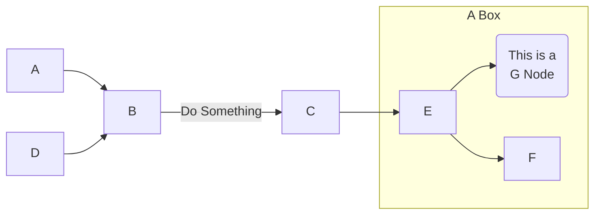
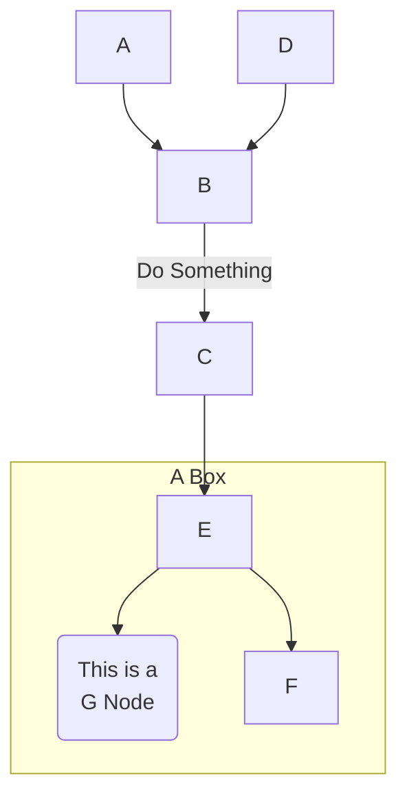
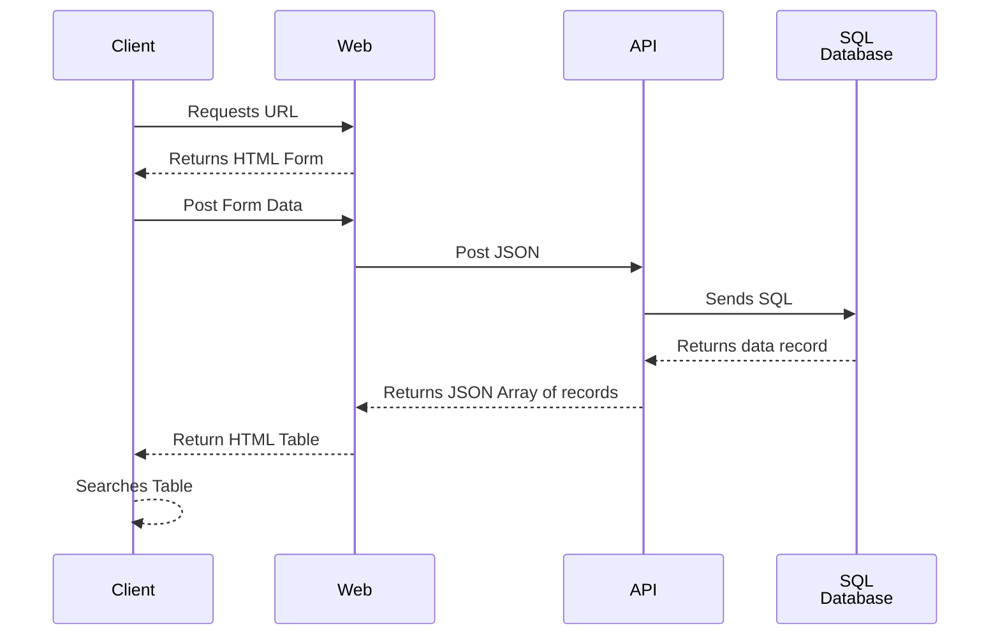
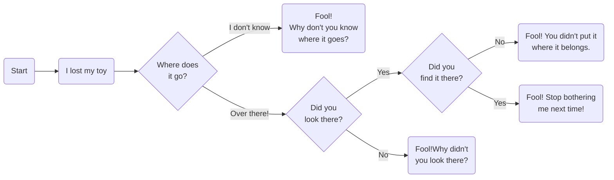
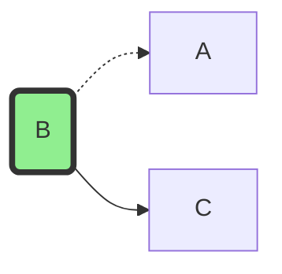
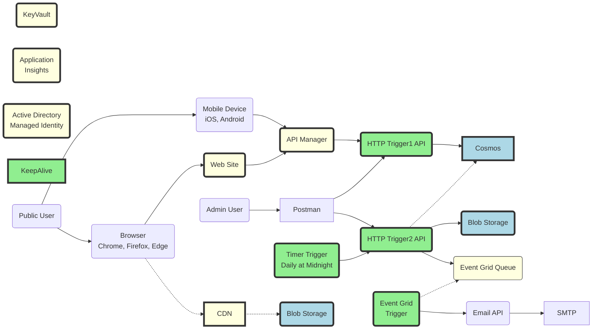

# Markdown1

- [Markdown1](#markdown1)
- [Principles](#principles)
- [Structure](#structure)
- [Mermaid](#mermaid)
  - [Example of a Left-to-Right (LR) graph](#example-of-a-left-to-right-lr-graph)
  - [Example of a Top-to-Bottom (TB) graph](#example-of-a-top-to-bottom-tb-graph)
  - [Sequence Diagrams](#sequence-diagrams)
- [Flowcharts](#flowcharts)
- [Nodes and Edges](#nodes-and-edges)
  - [Nodes](#nodes)
  - [Arrows](#arrows)
- [Architecture](#architecture)
- [Example Architecture Diagram](#example-architecture-diagram)
- [Mathematics](#mathematics)
  - [Quantum Mechanics](#quantum-mechanics)
  - [Dirac Equation](#dirac-equation)
  - [Schrödinger's Wave Equation](#schrödingers-wave-equation)
  - [Fourier Transform](#fourier-transform)
  - [Fermat's Equation](#fermats-equation)
- [References](#references)


First become familiar with basic markdown:

* [Syntax guidance for basic Markdown usage](https://docs.microsoft.com/en-us/azure/devops/project/wiki/markdown-guidance?view=azure-devops)
* [Syntax guidance for Markdown usage in Wiki](https://docs.microsoft.com/en-us/azure/devops/project/wiki/wiki-markdown-guidance?view=azure-devops)

# Principles

The most common questions asked about a documentation system are:

* Does a document exist for my needs?
* If so, how to I find it?
* Is this document the latest version?
* Is this document still relevant?
* Is this document complete?
* Are there other related documents?
* Who changed this document?
* What were those changes?
* How do I go about fixing an obvious mistake?


Wikis tend to solve these problems.

Understand these general principles:

* A Wiki differs from other types of folder-based documentation strategies such as SharePoint and shared folders in that its philosophy is *High Freedom; High Visibility; High Recovery*. Anyone can create a page, but not anonymously, and any mistake can be easily undone - by anyone.
* Azure DevOps Wiki allows you to see the history of just the changes that everyone has ever made to a page.
* Pages can be organized into a top-down tree-structured hierarchy to group similar pages together; but...
  * Users will more than likely start with the search bar to find a page - a bottom-up strategy. So make ensure you have good KEYWORDS and context to be able to find your page.
  * There are many ways to organize a set into a tree because things have more than one category; e.g. color, size, shape, etc. Only one can category be used to define a tree so make your choice. There will always be people who would choose differently, so make sure the bottom-up search approach is always a sufficient method to find a page.
  * The hierarchy is often good for new readers who wish to ramp up and don't necessarily know where to start. A hierarchy can give a book-like sequential structure or outline to follow and group related pages together under some topic. This is why our wiki is often structured with parents representing:
    * Applications
    * Concepts; e.g. Banner Standards, Best Practices
    * Proposals
    * How To's
    * Teams
    * Processes
* Linking between pages should include the entire URL, which contains the permalink Id (the /NUMBER/ part), so that if a page is moved, the link does not break. Everything on the URL that follows the permalink is ignored.

# Structure

There are many ways to structure a page; to choose major section headers. The goal is to get the reader to decide as quickly as possible if the page is pertinent or not. The purpose of the page will determine which sections to include.

Consider using one or more of the following sections in this order:

* **KEYWORDS: howto azure functions configure configuration ...** - No heading, lower-case, plural (since singular often matches plural), different spellings, space-delimited.
* **ABSTRACT: ...** - No heading, short, one-line, executive summary. Explicitly tell the readers why they should continue reading; if this page is what they are looking for.
* **# Overview** - more details about what the page entails.
* **# Quick Links** - a bullet list of links to resources or pages that a reader probably wants most of the time.
* **# Problem** - an overview of the "pain" that a reader might experience that this page might help solve. This is the "why" part of the page. In theory, every document has a problem that it solves for the reader; e.g. "How to do this", "You want to on-board a new developer", and "What are some things to consider".
* **# Requirements** - a list of constraints in order of priority; e.g. what is required, what is not required, what is out of scope. Requirements determine the solution (or architecture).
* **# Solution** - A list of steps or recommendations to solve the problem. This is the "how" part of the page.
* **# Architecture** - Diagrams of how the components of the solution are related.
* **# History** - Perhaps a list of dates and events that occurred for the topic (if applicable). This gives the reader an idea of how the concept has evolved and the pressures that lead to the solution.
* **# Background** - a paragraph of the problem and its inception. Similar to "History" but less date/time driven.
* **# References** - a bullet list of links to other pages that might be useful to the reader; a bibliography.

# Mermaid

Mermaid is a [GraphViz](http://www.graphviz.org/) plug-in that Azure Wiki pages can interpret. It allows you to create graphs and diagrams quickly using a text editor.


## Example of a Left-to-Right (LR) graph
```
graph LR
%% A comment
A --> B
B --> |Do Something| C
D --> B
C --> E
G(This is a<br>G Node)

subgraph "A Box"
  E --> F
  E --> G
end
```



## Example of a Top-to-Bottom (TB) graph
```
graph TB
A --> B
B --> |Do Something| C
D --> B
C --> E
G(This is a<br>G Node)

subgraph "A Box"
  E --> F
  E --> G
end
```



You can do Bottom-to-Top (BT) and Right-to-Left (RL) as well.

## Sequence Diagrams
Here is a classic multi-tier sequence diagram example.
```
sequenceDiagram

participant Client
participant Web
participant API
participant Database as SQL<br>Database

Client ->> Web: Requests URL
Web -->> Client: Returns HTML Form
Client ->> Web: Post Form Data
Web ->> API: Post JSON
API ->> Database: Sends SQL
Database -->> API: Returns data record
API -->> Web: Returns JSON Array of records
Web -->> Client: Return HTML Table
Client -->> Client: Searches Table
```



# Flowcharts
```
graph LR
A(Start) --> B
B(I lost my toy)
B --> C{Where does<br>it go?}
C --> |I don't know| D(Fool!<br>Why don't you know<br>where it goes?)
C --> |Over there!| E{Did you<br>look there?}
E --> |Yes| F{Did you<br>find it there?}
E --> |No| I(Fool!Why didn't<br>you look there?)
F --> |No| G(Fool! You didn't put it<br>where it belongs.)
F --> |Yes| H(Fool! Stop bothering<br>me next time!)
```



# Nodes and Edges
## Nodes
```
id[text]   Rectangular node
id (text)  Rounded rectangle node
id((text)) Circular node
id>text]   Right flag node
id{text}   Diamond node
```

## Arrows
```
>         Add tail arrow
-         Do not add tail arrow
--        Single line
--text--  Add text on a single line
==        Thick line
==text==  Thick line and text
-.-       dotted line
-.text.-  Dotted line and text
```

# Architecture
A great architectural diagram only needs these items:
* Boxes (or nodes) that define the nouns of the system; the components, classes, processes, modules, applications, resources, etc.
  * Names in the boxes should be environment agnostic; no DEV, QA, and PROD terms. Use "*" in place of those; e.g. `bh-dbt-*-cvv-funct`
  * Read arrows (with "R" tags or dotted lines) if the operation NEVER changes the system's state.
  * Write arrows (with "W" tags or solid lines) otherwise.
* Arrows (or edges) that define the verbs between the nouns and simultaneously show dependencies.
  * Arrow point from caller to callee; from dependent to independent. If X points to Y, then Y came first, Y doesn't know about X, X sends data to Y and Y replies with an answer, if Y is deleted, then X fails, but not vice versa. If data
  * Example: Below, data flows from A to B to C, but B reads from A and writes to C.

```
graph LR
B(B)
style B fill:LightGreen,stroke:#333,stroke-width:4px
B -.-> A
B --> C
```



* Rectangles can group nodes together in some arbitrary manner; e.g. by resource group, team, department, role, etc.

This strategy combines a dependency (or component) model with a data flow diagram because:
* Arrows always point to dependencies; and
* Data flows against the "R" arrows and with the "W" arrows.

# Example Architecture Diagram
Here is a typical diagram to show how to make them. It represents a customer using some device to use an enterprise application.  Dotted lines mean state is never changed. Solid lines means write operations where state might change.

```
graph LR

APIM(API Manager)
style APIM fill:LightYellow,stroke:#333,stroke-width:4px


Web(Web Site)
style Web fill:LightYellow,stroke:#333,stroke-width:4px

Cosmos
style Cosmos fill:LightBlue,stroke:#333,stroke-width:4px

Storage(Blob Storage)
style Storage fill:LightBlue,stroke:#333,stroke-width:4px

Storage1(Blob Storage)
style Storage1 fill:LightBlue,stroke:#333,stroke-width:4px

CDN
style CDN fill:LightYellow,stroke:#333,stroke-width:4px

KV(KeyVault)
style KV fill:LightYellow,stroke:#333,stroke-width:4px

Log(Application<br>Insights)
style Log fill:LightYellow,stroke:#333,stroke-width:4px

Email(Email API)
SMTP

AD(Active Directory<br>Managed Identity)
style AD fill:LightYellow,stroke:#333,stroke-width:4px


HttpTrigger1(HTTP Trigger1 API)
style HttpTrigger1 fill:LightGreen,stroke:#333,stroke-width:4px

HttpTrigger2(HTTP Trigger2 API)
style HttpTrigger2 fill:LightGreen,stroke:#333,stroke-width:4px

TimerTrigger(Timer Trigger<br>Daily at Midnight)
style TimerTrigger fill:LightGreen,stroke:#333,stroke-width:4px

EventGrid(Event Grid Queue)
style EventGrid fill:LightYellow,stroke:#333

EventGridTrigger(Event Grid<br>Trigger)
style EventGridTrigger fill:LightGreen,stroke:#333,stroke-width:4px

KeepAlive
style KeepAlive fill:LightGreen,stroke:#333,stroke-width:4px


User(Public User)
Admin(Admin User)
Mobile(Mobile Device<br>iOS, Android)
Browser(Browser<br>Chrome, Firefox, Edge)

User --> Mobile
User --> Browser

Admin --> Postman
Postman --> HttpTrigger1
Postman --> HttpTrigger2

Mobile --> APIM
Browser --> Web
Browser -.-> CDN
CDN -.-> Storage1

Web --> APIM

TimerTrigger --> HttpTrigger2
HttpTrigger1 --> Cosmos
HttpTrigger2 -.-> Cosmos
HttpTrigger2 --> Storage
HttpTrigger2 --> EventGrid
EventGridTrigger -.-> EventGrid
EventGridTrigger --> Email
Email --> SMTP

APIM --> HttpTrigger1
```




The diagram above implies these facts:

* A user can user a mobile device or a browser to user the SaaS app.
* The browser loads its main structure (Angular) from a CDN.
* From there, the devices connect to the functional part of the application via APIM.
* The REST API is a microservice function app
* There is timer that performs a daily operation that:
  * Reads data from Cosmos
  * Writes data to a Blob Storage Account
  * Can be triggered manually by an admin
* Key Vault and App Insights cross-cut the application.
* Data flows from

# Mathematics
You can include standard LaTeX mathematical formulae in two methods:

* Inline, like a span tag by enclosing the formula in single `$` characters, like this:
  * `$Y = \sqrt[3]{\frac{A}{B}}$` yields $Y = \sqrt[3]{\frac{A}{B}}$
* Block, like a div tag by enclosing in `$$` characters:

## Quantum Mechanics
```
$$
\frac{\partial^2 \psi}{\partial x^2}+\frac{\partial^2 \psi}{\partial z^2}-\frac{1}{c^2}
\frac{\partial^2 \psi}{\partial t^2}\nabla^2 \psi - \frac{1}{c^2}  \frac{\partial^2 \psi}{\partial t^2}
$$
```

$$
\frac{\partial^2 \psi}{\partial x^2}+\frac{\partial^2 \psi}{\partial z^2}-\frac{1}{c^2}  \frac{\partial^2 \psi}{\partial t^2}\nabla^2 \psi - \frac{1}{c^2}  \frac{\partial^2 \psi}{\partial t^2}
$$


## Dirac Equation
```
$$(i\hbar \gamma ^{\mu }\partial _{\mu }-mc)\psi (x)=0$$
```
$$(i\hbar \gamma ^{\mu }\partial _{\mu }-mc)\psi (x)=0$$

## Schrödinger's Wave Equation
```
$$i\hbar \frac{d}{dt}|\psi\rangle = \hat{H}|\psi\rangle$$
```

$$i\hbar \frac{d}{dt}|\psi\rangle = \hat{H}|\psi\rangle$$


## Fourier Transform
```
$$
f(x) = \int_{-\infty}^\infty \hat f(\xi) \,e ^ {2 ^ \pi i \xi x}
$$
```

$$
f(x) = \int_{-\infty}^\infty \hat f(\xi) \,e ^ {2 ^ \pi i \xi x}
$$

## Fermat's Equation
```
$$
x^n + y^n = z^n
$$
```

$$
x^n + y^n = z^n
$$

# References
* [How To Build The Perfect Company Wiki that your Team Loves](https://slite.com/blog/how-to-build-a-company-wiki-that-doesnt-suck)
* https://oeis.org/wiki/List_of_LaTeX_mathematical_symbols
* [Mermaid practical tutorial](https://www.programmersought.com/article/97975029972/)
* [Mathematical Expressions](https://www.overleaf.com/learn/latex/Mathematical_expressions)
